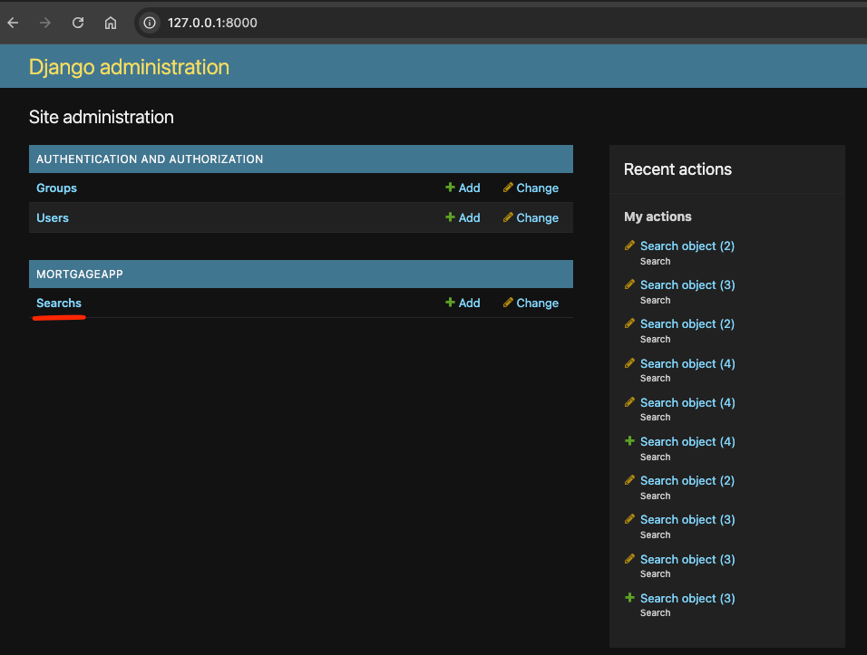
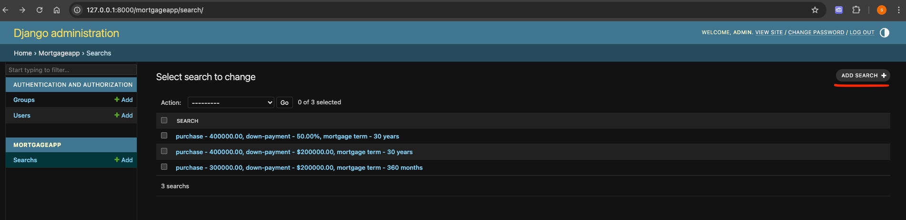
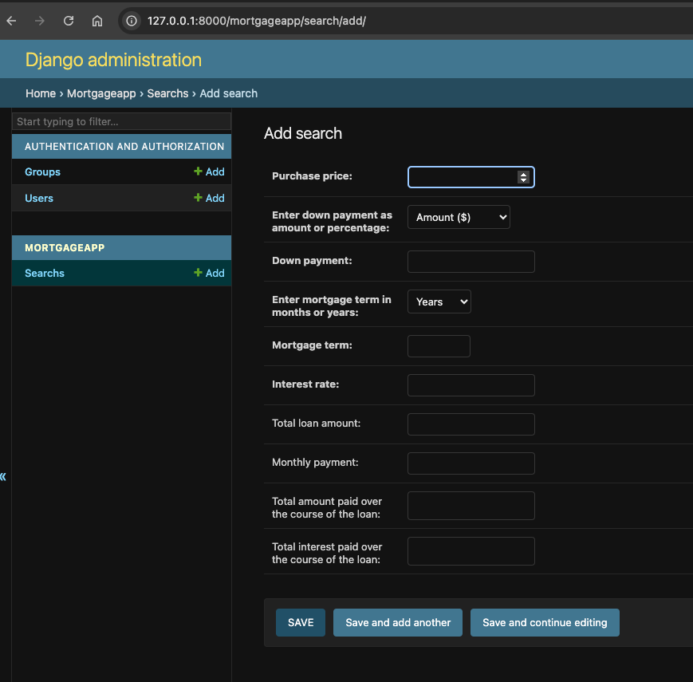
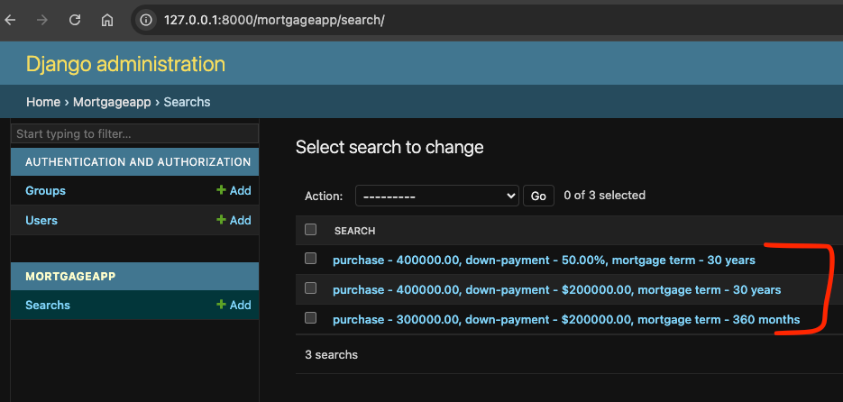
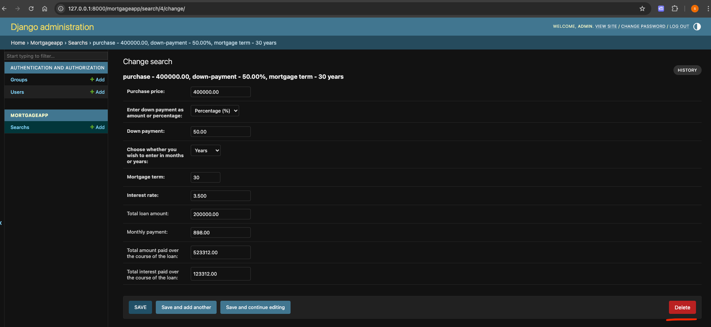

# MortgageCalculator

Mini Django (5.2.1 = latest) project that calculates mortgage using API - https://api-ninjas.com/api/mortgagecalculator

User inputs
- Purchase price
- Down Payment (in $ or %)
- Mortgage Term (in months or years)
- Interest rate

Output fields (un-editable / un-savable)
- Total loan amount remaining
- Monthly payment
- Total amount paid over the course of the loan
- Total interest paid over the course of the loan

## Setup

## API Key
Please sign up at https://api-ninjas.com/api/mortgagecalculator to get your API key & paste it in `MortgageCalculator/mortgageapp/settings_local.py` file under `NINJA_API_KEY` variable.

Please
install python 3.12.9 and create virtual environment out of it. 
Install dependencies using requirements.txt under project directory MortgageCalculator.  

`pip install -r requirements.txt`

Please go to your virtual environment & run following command in order to create tables under database  

`python manage.py makemigrations`  
`python manage.py migrate`

Please type in following command to start the server

`python manage.py runserver`  

With that, you should be able to access server on http://127.0.0.1:8000/

username: admin  
password: admin

## steps to check mortgage calculator workflow

1. Click on "Searchs"

2. Click on "ADD SEARCH" to **create** & fill in the details, as shown below, then click **Save**

3. For **update** or **retrive**, click on individual entry, then change concerned fields & then **Save**

4. For delete, please click on **Delete**

## unit tests

One can run unit tests using following command  

`python manage.py test .`

## Assumptions

1. Per my search, some lenders allow mortgage term to be 40 years (max setting for that field).
2. "Total amount paid over the course of the loan" calculation doesn't include down payment  
3. 3rd party API (ninja) will always give correct results (e.g. interest is not greater than loan amount etc)  
4. User agnostic app, different users may search for same input combinations.

## Future Scope

1. Distributed caching can be implemented for functions like get_data under utils.py (didn't do it to respect time of completion)
2. Use setting like dotenv for better security for API / secret keys.
